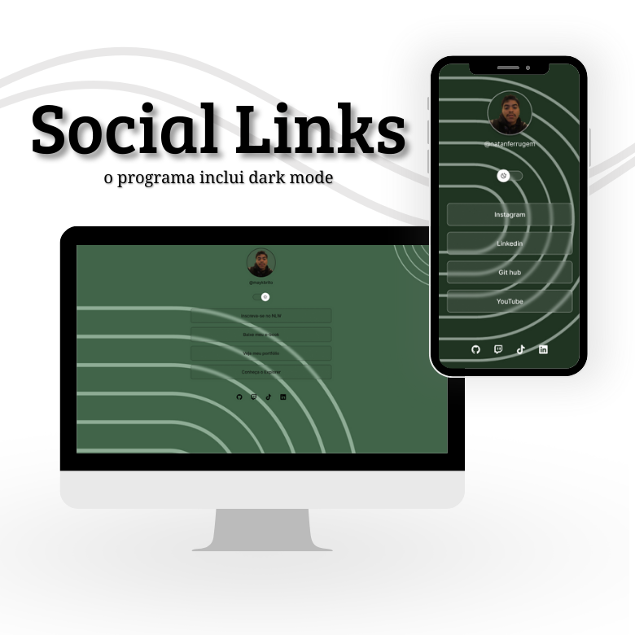

### social-links
<a href="https://natanferrugem.github.io/social-links"> PROJETO FINALIZADO </a>

Programa feito no curso "Discover" da Rocketseat sobre programação web   

  <a href="#-tecnologias">Tecnologias</a>&nbsp;&nbsp;&nbsp;|&nbsp;&nbsp;&nbsp;
  <a href="#-projeto">Projeto</a>&nbsp;&nbsp;&nbsp;|&nbsp;&nbsp;&nbsp;
  <a href="#-layout">Layout</a>&nbsp;&nbsp;&nbsp;|&nbsp;&nbsp;&nbsp;
  <a href="#memo-licença">Licença</a>

  

 

## 🚀 Tecnologias

Esse projeto foi desenvolvido com as seguintes tecnologias:

- HTML e CSS
- JavaScript
- Git e Github
- Figma

## 💻 Projeto

O DevLinks é um agregador de links para usar como cartão de visitas online.

- [Acesse o projeto finalizado, online](https://maykbrito.github.io/devlinks)

- [Assistir aulas](https://lp.rocketseat.com.br/devlinks/inscricao?utm_source=github&utm_medium=descricao&utm_campaign=capture-devlinks&utm_term=organic&utm_content=descricao-github-mayk-brito)

## 🔖 Layout

Você pode visualizar o layout do projeto através [DESSE LINK](https://www.figma.com/community/file/1187422022288947321). É necessário ter conta no [Figma](https://figma.com) para acessá-lo.

## Licença

Esse projeto está sob a licença MIT.
